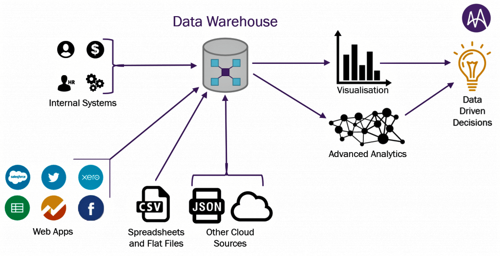

# Minería de Datos

## Motivación para la Minería de datos

  * (Variedad) Los métodos de recolección de datos han evolucionado muy rápidamente.
  * (Volumen) Las bases de datos han crecido exponencialmente
  * (Usuarios) Estos datos contienen información útil para las empresas, países, etc.
  * (Tecnología) El tamaño hace que la inspección manual sea casi imposible
  * (Método) Se requieren métodos de análisis de datos automáticos para optimizar el uso de estos enormes conjuntos de datos

## ¿Qué es la minería de datos?

Es el análisis de **conjuntos de datos** (a menudo grandes) para encontrar **relaciones insospechadas** (conocimiento) y resumir los datos de **formas novedosas** que sean **comprensibles y útiles** para el propietario/usuario de los datos.

 Principles of Data Mining (Hand et.al. 2001) 

## Datos y conocimiento (Insumo/Resultado)

### Datos:

  * se refieren a instancias únicas y primitivas (objetos elementales, personas, eventos, puntos en el tiempo, etc.)
  * describir propiedades individuales
  * a menudo son fáciles de recolectar u obtener (por ejemplo, cajeros de escáner, internet, etc.)
  * no nos permiten hacer predicciones o pronósticos

> Ejercicio 1

Elija un sector/área y describa los potenciales datos que se tienen disponibles

### Conocimiento:

  * (Características) se refiere a clases de instancias (conjuntos de ...)
  * (Forma) describe patrones generales, estructuras, leyes,
  * (Declaración) consta de la menor cantidad de declaraciones posibles
  * (Proceso) a menudo es difícil y lleva mucho tiempo encontrar u obtener
  * (Acciones) nos permite hacer predicciones y pronósticos

> Ejercicio 2

Identifique potenciales conocimientos que se pueden explorar de las respuestas del ejercicio anterior

## Requerimientos

  * Disponibilidad para aprender 
  * Mucha paciencia
    - Interactúa con otras áreas
    - Pre procesamiento de datos 
  * Creatividad
  * Rigor, prueba y error

## knowledge discovery in databases (KDD)

  * Problema (pregunta de investigación) 
  * Recopilación de la fuente de datos
    + Base de datos
  * Selección 
    + Datos objetivos 
  * Pre procesado
    + Datos pre procesados
  * Transformación
    + Datos transformados
  * Minería de datos
    + Patrones
  * Interpretación/evaluación
    + Conocimiento
  * Visualización de datos
    + Reporte

## Recopilación de información

  * Censos
    + Población y vivienda: 2012 (x), 2001 (x), 1992 (x), 1976 (x), 1950 https://www.ipums.org/ INE
    + Agropecuario: (UPA=Unidades productivas agropecuarias) 2013, 1984
    + Económico.
  * Encuestas
    + Periódicas: EH (bienestar), ENDSA (salud), ETE ECE (empleo), ENA (Agropecuarias)
    + Temáticas: Coca, Violencia a la mujer, Trabajo infantil NNA, Uso de tiempo , presupuestos familiares, Adulto mayor (UDAPE), Mujeres embarazadas - Juana Zurduy (UDAPE) 
    + Estudios de observación: Alcance limitado. 
    + Internacionales: LAPOP, Latinobarómetro 
  * Registros administrativos (digital/no digital)
    + Espacial/geográfico: Tarea: Buscar una fuente de datos que permita trabajar con mapas (.shp) shapefiles
    +
  * Información de internet (registros)
    + (API) Es posible obtener los comentarios que existen en facebook de forma automática, ejemplo.
    +
    
## Data Warehouse

## Data Warehouse in R

